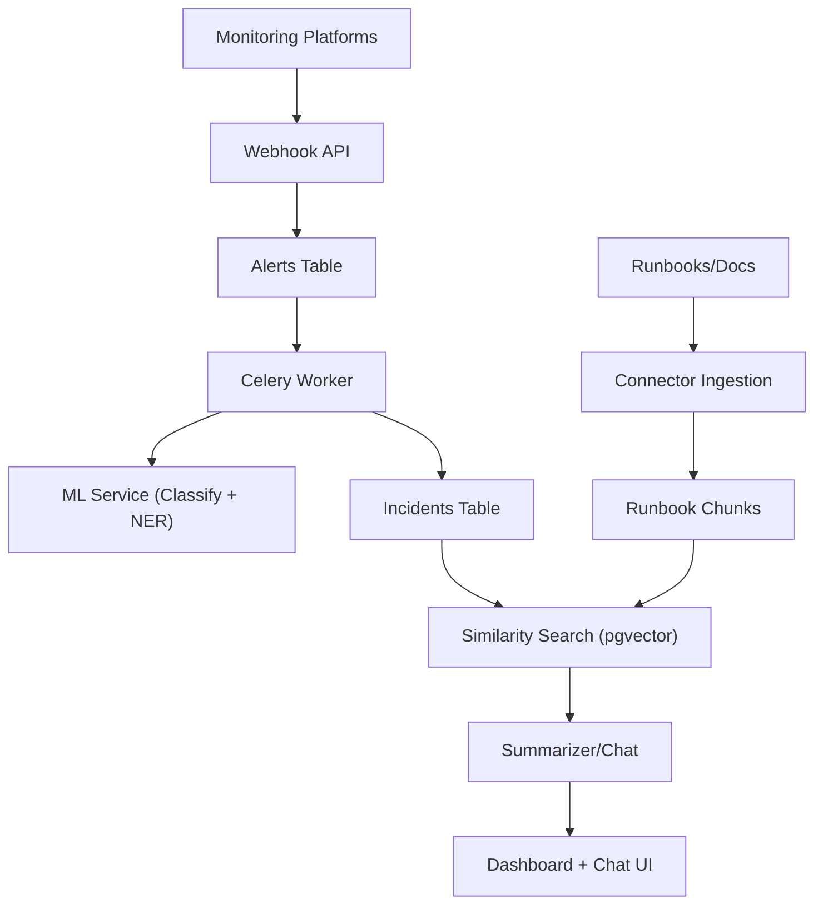
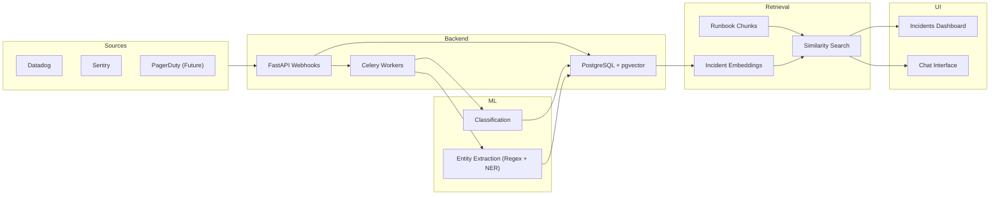
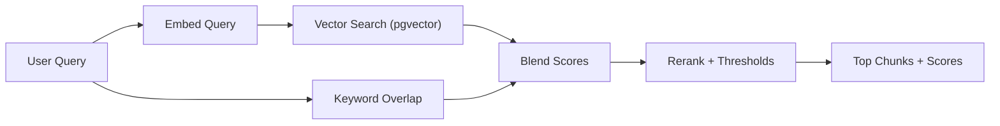

# Architecture & Data Flow

## System Overview
OpsRelay ingests monitoring alerts, groups them into incidents, enriches them
with ML classification and entity extraction, and provides a retrieval-based
assistant to summarize context and recommend next steps.

## Data Flow

## System Diagram

## RAG Retrieval (Hybrid)

### Retrieval Configuration (Env Vars)
- `RAG_VECTOR_WEIGHT` (default `0.7`): weight for vector similarity.
- `RAG_KEYWORD_WEIGHT` (default `0.3`): weight for keyword overlap.
- `RAG_MIN_SCORE` (default `0.1`): minimum blended score to keep a match.
- `RAG_MIN_KEYWORD_OVERLAP` (default `0.05`): minimum keyword overlap for eligibility.
- `RAG_RERANK_TITLE_BOOST` (default `0.08`): boost if query appears in title.
- `RAG_RERANK_PHRASE_BOOST` (default `0.05`): boost if query appears in content.

### Retrieval Mechanics
- **Vector search:** embed the query and compute L2 distance against stored chunk embeddings.
  - `vector_score = 1 / (1 + l2_distance)`
- **Keyword overlap:** tokenized Jaccard overlap between query tokens and chunk tokens.
  - `keyword_score = |tokens_q ∩ tokens_chunk| / |tokens_q ∪ tokens_chunk|`
- **Hybrid scoring:** blended score:
  - `hybrid = (vector_score * RAG_VECTOR_WEIGHT) + (keyword_score * RAG_KEYWORD_WEIGHT)`
- **Reranker:** boosts if the full query string appears in title/content:
  - `rerank = (query_in_title ? RAG_RERANK_TITLE_BOOST : 0) + (query_in_content ? RAG_RERANK_PHRASE_BOOST : 0)`
- **Final score + thresholds:**
  - `final = min(1.0, hybrid + rerank)`
  - keep if `keyword_score >= RAG_MIN_KEYWORD_OVERLAP` **and** `final >= RAG_MIN_SCORE`

#### Example
Query: `"connection pool"`  
Chunk title: `"Database Connection Pool Saturation"`  
Chunk content contains `"connection pool exhausted errors"`

Assume:
- `l2_distance = 0.95` → `vector_score = 1 / (1 + 0.95) = 0.5128`
- `tokens_q = {connection, pool}`
- `tokens_chunk = {database, connection, pool, saturation, exhausted, errors}`
- `keyword_score = 2 / 6 = 0.3333`

With defaults:
- `RAG_VECTOR_WEIGHT = 0.7`, `RAG_KEYWORD_WEIGHT = 0.3`
- `hybrid = (0.5128 * 0.7) + (0.3333 * 0.3) = 0.4580`
- `rerank = 0.08 (title match) + 0.05 (content match) = 0.13`
- `final = min(1.0, 0.4580 + 0.13) = 0.5880`

If `RAG_MIN_KEYWORD_OVERLAP = 0.05` and `RAG_MIN_SCORE = 0.1`, this chunk is retained.

## Evals
### Metrics
- `retrieval_relevance`: LLM judge checks if retrieved chunks are relevant to the question.
- `answer_relevance`: LLM judge checks if the answer addresses the question.
- `groundedness`: LLM judge checks if the answer is supported by retrieved chunks.
- `correctness`: LLM judge checks consistency with a gold answer when provided.

### Methodology
- Eval runner: `backend/tools/run_rag_eval.py`
- Dataset: `datasets/evals/rag_eval_cases.jsonl`
- For each case:
  - Retrieve top-k runbook chunks.
  - Generate an answer using retrieved context only.
  - Score relevance/groundedness/correctness with an OpenAI judge.
- Failure summary lists any cases with a score < `0.6`.

## Core Components
- Webhook API: Receives alerts, verifies signatures, stores raw payloads.
- Database: PostgreSQL + pgvector; primary store for alerts/incidents/chunks.
- Celery Workers: Async classification, entity extraction, grouping.
- ML Service: Rule-based classification, regex extraction, NER fallback.
- Retrieval Layer: Vector similarity for past incidents/runbooks.
- Summarizer: Builds context and suggests next steps.
- Dashboard + Chat: Operator UI for review and triage.

## Key Data Models
- Alert: Raw payload, ML outputs, extracted entities.
- Incident: Grouped alerts, status, summary, suggested actions.
- RunbookChunk: Document segments for retrieval.

## Scaling & Reliability Notes
- Webhook endpoints must respond quickly (<2s), async for heavy work.
- ML calls should degrade gracefully with safe defaults.
- Provenance should be stored for classification/entity extraction.
