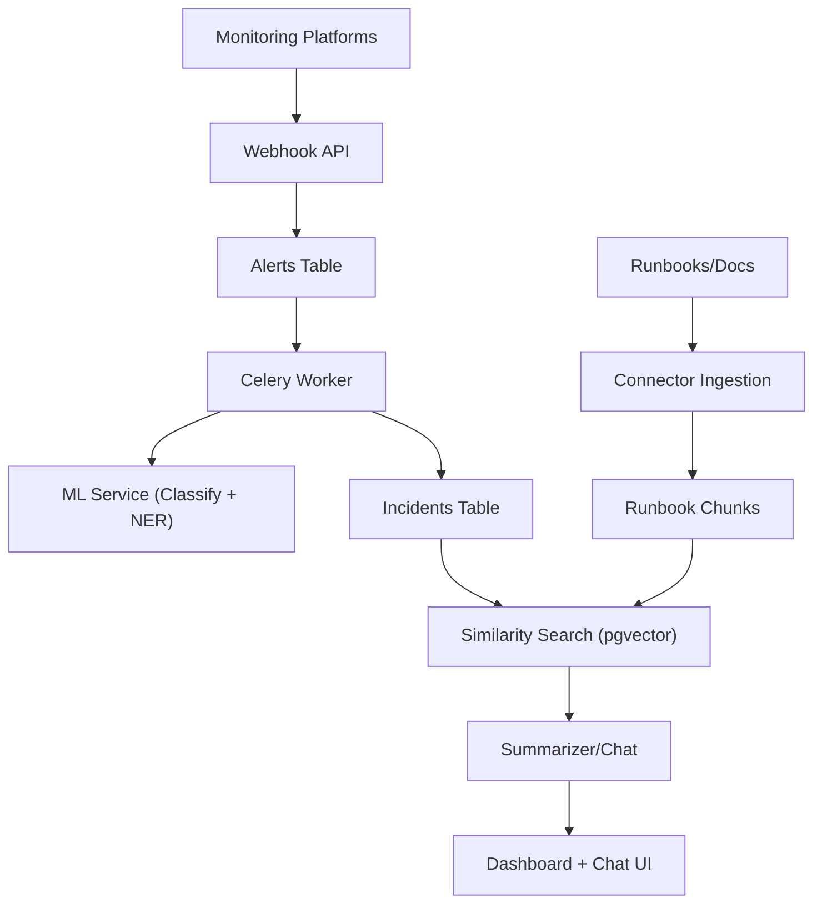
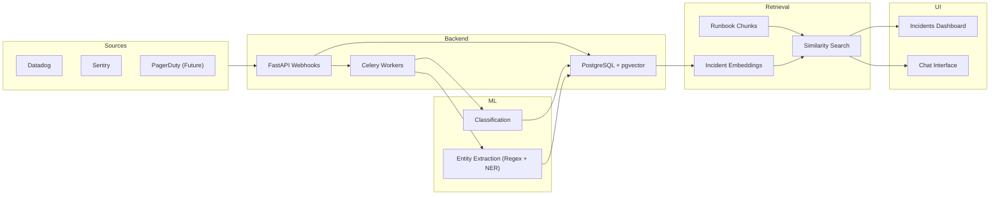

# Architecture & Data Flow

## System Overview
OpsRelay ingests monitoring alerts, groups them into incidents, enriches them
with ML classification and entity extraction, and provides a retrieval-based
assistant to summarize context and recommend next steps.

## Data Flow

## System Diagram

## Core Components
- Webhook API: Receives alerts, verifies signatures, stores raw payloads.
- Database: PostgreSQL + pgvector; primary store for alerts/incidents/chunks.
- Celery Workers: Async classification, entity extraction, grouping.
- ML Service: Rule-based classification, regex extraction, NER fallback.
- Retrieval Layer: Vector similarity for past incidents/runbooks.
- Summarizer: Builds context and suggests next steps.
- Dashboard + Chat: Operator UI for review and triage.

## Key Data Models
- Alert: Raw payload, ML outputs, extracted entities.
- Incident: Grouped alerts, status, summary, suggested actions.
- RunbookChunk: Document segments for retrieval.

## Scaling & Reliability Notes
- Webhook endpoints must respond quickly (<2s), async for heavy work.
- ML calls should degrade gracefully with safe defaults.
- Provenance should be stored for classification/entity extraction.
